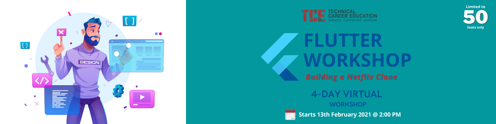

# Technical Career Education
## Flutter Workshop Week 2
### Introduction to Grids, GridViews & Netflix Clone: Part 1

  

> We all love chilling with Netflix, but have you ever wondered how Netflix is built? What  if you get a chance to develop a great application like Netflix?  Join us in our Virtual? Flutter Workshop and learn to build Netflix by understanding the fundamentals.  
Watch the introduction teaser [here](https://www.youtube.com/watch?v=6HMfQLOVF_U).

Here is <a href="http://tce360.com/#/">Technical Career Education</a> with their own 4-Day Virtual Flutter Workshop.

This repository is maintained to update my learning in the course of 4 days spread over 2 weeks of the workshop.

Date          | Day           | Timings      | Topics 
------------- | ------------- | ------------ | ----------
13-02-2021  | Day 1 - Let's Start with Flutter | 2:00PM to 5:00PM  | Basics of Flutter - Dart - States of Flutter - Flutter themes
14-02-2021  | Day 2  | 10:00AM to 1:00PM | Components of Flutter UI - TO-DO list UI building
20-02-2021 | Day 3 | 2:00PM to 5:00PM | Structuring the code - Introduction to Python API
21-02-2021 | Day 4 | 10AM to 5:00PM | Mini project

